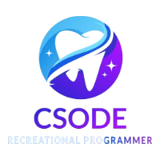

# 🚀 Neovim Setup

<div align="center">
  
  <h3>A Modern, Feature-Rich Neovim Development Environment</h3>
</div>

---

## 📚 Table of Contents

- [🎯 Overview](#-overview)
- [✨ Features](#-features)
- [📋 Prerequisites](#-prerequisites)
- [🔧 Installation](#-installation)
- [🗂️ Configuration Structure](#️-configuration-structure)
- [⌨️ Keybindings Reference](#️-keybindings-reference)
- [🔌 Plugin Ecosystem](#-plugin-ecosystem)
- [🛠️ Custom Plugins](#️-custom-plugins)
- [🎨 Customization Guide](#-customization-guide)
- [🐛 Troubleshooting](#-troubleshooting)
- [📖 Advanced Usage](#-advanced-usage)
- [🤝 Contributing](#-contributing)

---

## 🎯 Overview

This Neovim configuration is designed for developers who want a powerful, efficient, and beautiful coding environment. It combines the best of modern Neovim plugins with custom-built functionality to create a seamless development experience.

### Key Philosophy
- **Minimalism with Power**: Clean interface with powerful features
- **Developer-Centric**: Built by developers, for developers
- **Extensible**: Easy to customize and extend
- **Performance**: Fast startup and responsive editing

---

## ✨ Features

### 🔍 **Smart Navigation & Search**
- Fuzzy file finding with Telescope
- Project-wide text search
- Git integration with Fugitive
- Buffer management system
- Markdown link navigation

### 💻 **Development Tools**
- Full LSP support with auto-completion
- Syntax highlighting with TreeSitter
- Custom compile mode for multiple languages
- Git workflow integration
- Auto-formatting on save

### 📝 **Productivity Features**
- TODO management system
- Floating todo buffer
- Snippet management with LuaSnip
- Undo tree visualization
- Org-mode support

### 🎨 **Visual Enhancements**
- Tokyo Night theme
- Icons and beautiful UI
- Custom syntax highlighting
- Configurable layouts

---

## 📋 Prerequisites

Before installing this configuration, ensure you have:

### Required Software
- **Neovim** >= 0.8.0
- **Git** (for plugin management)
- **Node.js** & **npm** (for LSP servers)
- **Python 3** with pip
- **GCC/Clang** (for TreeSitter)

### Recommended Tools
```bash
# Language servers and formatters
npm install -g pyright typescript typescript-language-server
pip install black
cargo install stylua  # For Lua formatting
```

### System Dependencies
```bash
# Ubuntu/Debian
sudo apt install build-essential curl git nodejs npm python3-pip

# macOS
brew install neovim node python3 git

# Arch Linux
sudo pacman -S neovim nodejs npm python-pip git base-devel
```

---

## 🔧 Installation

### Quick Setup
```bash
# 1. Backup existing configuration
mv ~/.config/nvim ~/.config/nvim.backup

# 2. Clone this repository
git clone https://github.com/yourusername/nvim-config.git ~/.config/nvim

# 3. Start Neovim and install plugins
nvim
# Wait for Packer to install plugins automatically
:PackerSync

# 4. Install LSP servers
:Mason
# Install desired language servers from the Mason interface
```

### Manual Installation Steps

1. **Clone the Repository**
   ```bash
   git clone https://github.com/yourusername/nvim-config.git ~/.config/nvim
   ```

2. **First Launch**
   ```bash
   nvim
   ```
   - Packer will automatically install on first run
   - Plugins will be downloaded and compiled

3. **Install Language Servers**
   ```vim
   :Mason
   ```
   Install these recommended servers:
   - `lua_ls` (Lua)
   - `pyright` (Python)
   - `ts_ls` (TypeScript/JavaScript)
   - `bashls` (Bash)
   - `clangd` (C/C++)

4. **Verify Installation**
   ```vim
   :checkhealth
   ```

---

## 🗂️ Configuration Structure

```
~/.config/nvim/
├── init.lua                          # Entry point
├── lua/
│   └── csode/
│       ├── autocmd.lua               # Auto commands
│       ├── colorscheme.lua           # Theme configuration
│       ├── keymap.lua                # Key mappings
│       ├── local.lua                 # Local plugin loader
│       ├── options.lua               # Neovim options
│       ├── plugins.lua               # Plugin definitions
│       ├── local_plugins/            # Custom plugins
│       │   ├── nvim_compile.lua      # Compile mode
│       │   ├── markdown_link_nav.lua # Markdown navigation
│       │   ├── todo.lua              # TODO management
│       │   └── todo_buffer.lua       # Floating TODO buffer
│       └── plugin_config/            # Plugin configurations
│           ├── buffer-manager.lua
│           ├── coq.lua
│           ├── conform.lua
│           ├── fugitive.lua
│           ├── lsp-zero.lua
│           ├── luasnip.lua
│           ├── telescope.lua
│           └── treesitter.lua
└── lua/snippets/                     # Custom snippets
    └── markdown.lua
```

### Configuration Breakdown

#### **init.lua** - Entry Point
The main configuration file that loads all modules:
```lua
require("csode.options")      -- Neovim settings
require("csode.keymap")       -- Key bindings
require("csode.plugins")      -- Plugin management
require("csode.local").load() -- Custom plugins
require("csode.colorscheme")  -- Theme
require("csode.autocmd")      -- Auto commands
```

#### **Core Modules**
- **options.lua**: Core Neovim settings (tabs, search, UI)
- **keymap.lua**: All key mappings and shortcuts
- **plugins.lua**: Plugin definitions using Packer
- **colorscheme.lua**: Theme configuration

#### **Custom Plugins Directory**
All custom-built functionality lives in `local_plugins/`:
- **nvim_compile.lua**: Advanced compilation system
- **todo.lua**: TODO comment management
- **todo_buffer.lua**: Floating TODO file interface
- **markdown_link_nav.lua**: Navigate between markdown files

---

## ⌨️ Keybindings Reference

### 🔧 **Leader Key**: `<Space>`

### 📁 **File Navigation**
| Key | Action | Description |
|-----|--------|-------------|
| `<leader>pf` | Find Files | Fuzzy find files in project |
| `<C-p>` | Git Files | Find files tracked by Git |
| `<leader>ps` | Search Text | Project-wide text search |
| `<leader>o` | File Explorer | Open file explorer |
| `<C-h>/<C-l>` | Switch Windows | Navigate between splits |

### 💻 **Code Navigation & LSP**
| Key | Action | Description |
|-----|--------|-------------|
| `gd` | Go to Definition | Jump to symbol definition |
| `gr` | Show References | List all references |
| `K` | Show Documentation | Display hover documentation |
| `<leader>rn` | Rename Symbol | Rename symbol under cursor |
| `<leader>ca` | Code Actions | Show available code actions |

### 🔨 **Development Tools**
| Key | Action | Description |
|-----|--------|-------------|
| `<leader>c` | Compile Mode | Interactive compilation |
| `<leader>gs` | Git Status | Open Git status (Fugitive) |
| `<leader>u` | Undo Tree | Visualize undo history |
| `<leader>w` | Save File | Quick save |
| `<leader>h` | Clear Highlight | Clear search highlights |

### 📝 **Productivity**
| Key | Action | Description |
|-----|--------|-------------|
| `<leader>td` | Todo Buffer | Open floating TODO file |
| `<leader>?` | Show Keymaps | Display all keybindings |
| `<leader>mp` | Markdown Preview | Toggle markdown preview |

### ✏️ **Text Editing**
| Key | Action | Description |
|-----|--------|-------------|
| `J/K` (Visual) | Move Lines | Move selected lines up/down |
| `<leader>y` | Yank to Clipboard | Copy to system clipboard |
| `<leader>p` | Paste Replace | Paste without overwriting register |
| `<leader>s` | Search Replace | Search and replace current word |

### 🔍 **Search & Navigation**
| Key | Action | Description |
|-----|--------|-------------|
| `n/N` | Next/Prev Match | Navigate search results (centered) |
| `<C-d>/<C-u>` | Page Down/Up | Scroll with cursor centered |
| `<leader>pws` | Search Word | Search current word in project |

---

## 🔌 Plugin Ecosystem

### 🎨 **UI & Themes**
- **[tokyonight.nvim](https://github.com/folke/tokyonight.nvim)**: Beautiful Tokyo Night theme
- **[nvim-web-devicons](https://github.com/kyazdani42/nvim-web-devicons)**: File type icons
- **[org-bullets.nvim](https://github.com/akinsho/org-bullets.nvim)**: Pretty org-mode bullets

### 🔍 **Navigation & Search**
- **[telescope.nvim](https://github.com/nvim-telescope/telescope.nvim)**: Fuzzy finder
- **[telescope-fzf-native.nvim](https://github.com/nvim-telescope/telescope-fzf-native.nvim)**: Native FZF sorter
- **[buffer-manager.nvim](https://github.com/xsoder/buffer-manager.nvim)**: Advanced buffer management

### 💻 **LSP & Completion**
- **[lsp-zero.nvim](https://github.com/VonHeikemen/lsp-zero.nvim)**: LSP configuration made easy
- **[mason.nvim](https://github.com/williamboman/mason.nvim)**: LSP server installer
- **[nvim-cmp](https://github.com/hrsh7th/nvim-cmp)**: Completion engine
- **[coq_nvim](https://github.com/ms-jpq/coq_nvim)**: Fast completion alternative

### 🌳 **Syntax & Parsing**
- **[nvim-treesitter](https://github.com/nvim-treesitter/nvim-treesitter)**: Advanced syntax highlighting
- **[LuaSnip](https://github.com/L3MON4D3/LuaSnip)**: Snippet engine

### 🔧 **Development Tools**
- **[vim-fugitive](https://github.com/tpope/vim-fugitive)**: Git integration
- **[conform.nvim](https://github.com/stevearc/conform.nvim)**: Code formatting
- **[todo-comments.nvim](https://github.com/folke/todo-comments.nvim)**: TODO highlighting
- **[undotree](https://github.com/mbbill/undotree)**: Undo history visualization

### 📝 **Writing & Documentation**
- **[orgmode](https://github.com/nvim-orgmode/orgmode)**: Org-mode implementation
- **[markdown-preview.nvim](https://github.com/iamcco/markdown-preview.nvim)**: Live markdown preview

---

## 🛠️ Custom Plugins

This configuration includes several custom-built plugins for enhanced functionality:

### 🔨 **Compile Mode** (`nvim_compile.lua`)

An Emacs-inspired compilation system with error navigation.

**Features:**
- Automatic project type detection
- Error parsing and highlighting
- Jump to error locations
- Compilation history
- CMake project support

**Usage:**
```vim
:CompileMode        " Interactive mode
<leader>cc          " Quick compile
```

**Supported Project Types:**
- **Rust**: `cargo run`, `cargo build`, `cargo test`
- **Make**: `make`, `make build`
- **C++**: `g++ % -o %:r && ./%:r`
- **Python**: `python3 %`
- **CMake**: Automatically detects and uses build directory

**Error Navigation:**
- `<Enter>`: Jump to error under cursor or next error
- `p`: Jump to previous error
- Errors are highlighted in red, warnings in yellow

### 📝 **TODO Management** (`todo.lua` & `todo_buffer.lua`)

Comprehensive TODO management system.

**Features:**
- Find TODOs in current buffer
- Floating TODO file interface
- Quick access to global TODO list

**Usage:**
```vim
:TodoList           " List TODOs in current buffer
<leader>td          " Open floating TODO buffer
:Td                 " Same as above
```

**TODO Buffer Features:**
- Floating window interface
- Auto-save detection
- Customizable size and position
- `q` to close (with unsaved changes protection)

### 🔗 **Markdown Link Navigation** (`markdown_link_nav.lua`)

Navigate between markdown files using links.

**Features:**
- Support for `[text](file.md)` and `[[file.md]]` syntax
- Jump history with back navigation
- Relative path resolution

**Usage:**
```vim
:FollowMarkdownLink " Follow link under cursor
:MarkdownGoBack     " Go back to previous file
```

---

## 🎨 Customization Guide

### 🎯 **Adding New Keybindings**

Edit `lua/csode/keymap.lua`:
```lua
-- Add your custom keybindings
vim.keymap.set("n", "<leader>my", function()
    -- Your custom function
    print("My custom keybinding!")
end, { desc = "My custom action" })
```

### 🔌 **Installing New Plugins**

1. Add to `lua/csode/plugins.lua`:
```lua
use({
    "author/plugin-name",
    config = function()
        require("csode.plugin_config.plugin-name")
    end,
})
```

2. Create configuration file `lua/csode/plugin_config/plugin-name.lua`:
```lua
require("plugin-name").setup({
    -- Plugin configuration
})
```

3. Run `:PackerSync` to install

### 🎨 **Changing Themes**

1. Add theme plugin to `plugins.lua`
2. Modify `lua/csode/colorscheme.lua`:
```lua
local colorscheme = "your-theme-name"
```

### ⚙️ **Modifying Options**

Edit `lua/csode/options.lua`:
```lua
-- Example: Change tab width
vim.opt.tabstop = 2
vim.opt.shiftwidth = 2

-- Example: Enable line wrapping
vim.opt.wrap = true
```

### 🔧 **Custom LSP Configuration**

Modify `lua/csode/plugin_config/lsp-zero.lua`:
```lua
-- Add custom LSP server
require("mason-lspconfig").setup({
    ensure_installed = {
        "lua_ls",
        "pyright",
        "your_new_server",  -- Add here
    },
})
```

---

## 🐛 Troubleshooting

### Common Issues

#### **Plugin Installation Fails**
```bash
# Clean plugin directory and reinstall
rm -rf ~/.local/share/nvim/site/pack/packer
nvim +PackerSync
```

#### **LSP Not Working**
```vim
:checkhealth lsp       " Check LSP status
:LspInfo              " Show active LSP servers
:Mason                " Install missing servers
```

#### **Slow Startup**
```vim
:startuptime          " Profile startup time
```

#### **TreeSitter Errors**
```vim
:TSUpdate             " Update parsers
:TSInstall <language> " Install specific parser
```

### Debug Mode

Enable debug logging:
```lua
-- Add to init.lua
vim.lsp.set_log_level("debug")
```

### Getting Help

1. **Check Health**: `:checkhealth`
2. **Plugin Status**: `:PackerStatus`
3. **LSP Info**: `:LspInfo`
4. **Mason Status**: `:Mason`

---

## 📖 Advanced Usage

### 🔄 **Session Management**

The buffer manager includes session support:
```vim
<leader>sl          " Load session
```

Sessions are automatically saved to:
`~/.local/share/nvim/buffer-manager-sessions/`

### 📊 **Custom Snippets**

Add snippets to `lua/snippets/<filetype>.lua`:
```lua
local ls = require("luasnip")
local s = ls.snippet
local t = ls.text_node
local i = ls.insert_node

return {
    s("mysnippet", {
        t("Hello "),
        i(1, "World"),
        t("!"),
    }),
}
```

### 🎯 **Project-Specific Configuration**

Create `.nvim.lua` in your project root:
```lua
-- Project-specific settings
vim.opt.tabstop = 2
vim.opt.expandtab = true

-- Project-specific keybindings
vim.keymap.set("n", "<leader>pb", ":!npm run build<CR>")
```

### 🔧 **Custom Compile Commands**

The compile mode supports custom project detection:
```lua
-- In nvim_compile.lua, add custom detection
local function is_my_project()
    return vim.fn.filereadable("my-project-file") == 1
end
```

### 📝 **Advanced TODO Configuration**

Configure TODO buffer location and appearance:
```lua
-- In local.lua
require("csode.local_plugins.todo_buffer").setup({
    target_file = "~/my-custom-todos.md",
    width = 0.9,
    height = 0.8,
    position = "center",
    border = "double",
})
```

---

## 🚀 Performance Tips

### Optimization Settings

Already included optimizations:
- **Fast startup**: Lazy loading for most plugins
- **Efficient search**: FZF native integration
- **Smart completion**: COQ for fast completions
- **Minimal UI**: Clean interface without bloat

### Monitoring Performance

```vim
:startuptime          " Measure startup time
:profile start profile.log
:profile func *
:profile file *
" ... do some work ...
:profile stop
```

---

## 🔄 Updates & Maintenance

### Keeping Up to Date

```bash
# Update configuration
cd ~/.config/nvim
git pull

# Update plugins
nvim +PackerUpdate

# Update LSP servers
nvim +Mason
```

### Regular Maintenance

- **Weekly**: Update plugins with `:PackerUpdate`
- **Monthly**: Update LSP servers via `:Mason`
- **As needed**: Update TreeSitter parsers with `:TSUpdate`

---

## 🤝 Contributing

### Reporting Issues

When reporting issues, include:
1. Neovim version: `:version`
2. Plugin status: `:PackerStatus`
3. Health check: `:checkhealth`
4. Minimal reproduction steps

### Contributing Code

1. Fork the repository
2. Create a feature branch
3. Make your changes
4. Test thoroughly
5. Submit a pull request

### Code Style

- Use descriptive variable names
- Comment complex functionality
- Follow existing patterns
- Test with `:checkhealth`

---

## 📄 License

This configuration is released under the MIT License. Feel free to use, modify, and distribute as needed.

---

## 🙏 Acknowledgments

Special thanks to the Neovim community and plugin authors who make this configuration possible:
- [Neovim Team](https://neovim.io/)
- [Plugin Authors](https://github.com/rockerBOO/awesome-neovim)
- [Community Contributors](https://www.reddit.com/r/neovim/)

---

<div align="center">
  <p>Made with ❤️ for the Neovim community</p>
</div>
