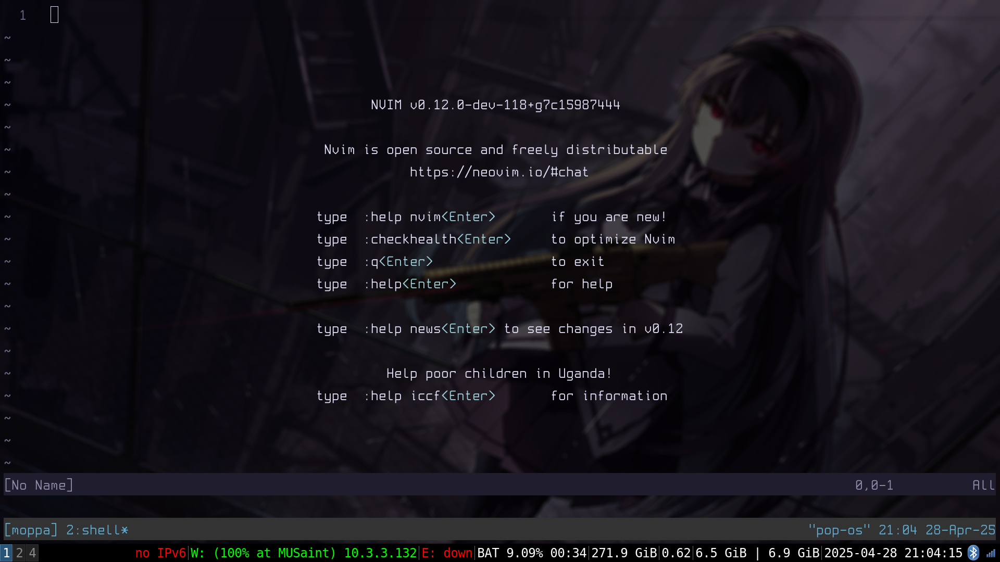
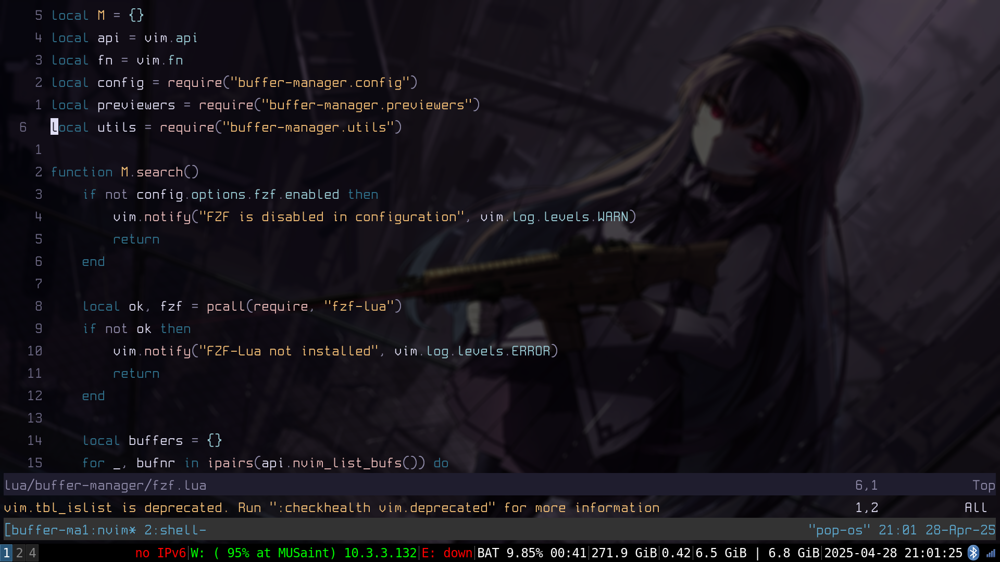
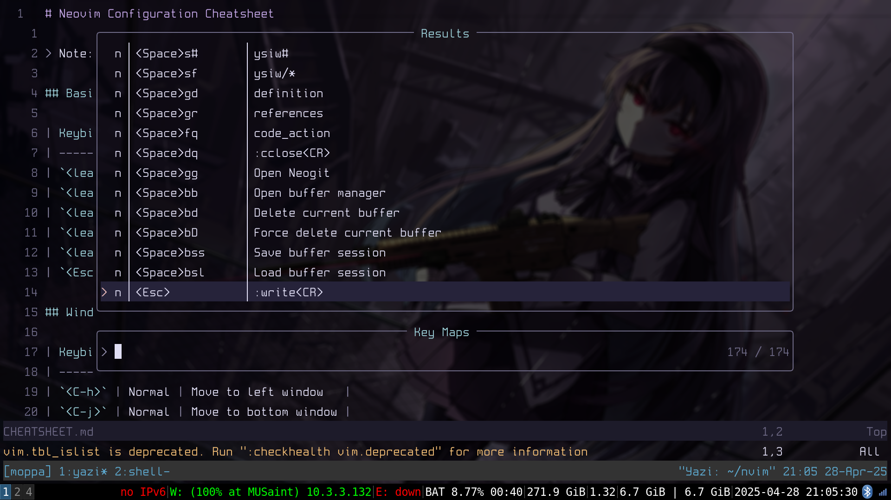

# My Neovim Configuration

Welcome to my Neovim configuration. This is my personal setup optimized for development with comprehensive LSP support.

[View Neovim Cheatsheet](./CHEATSHEET.md)

## Preview





## Plugin List

- [Lazy](https://github.com/folke/lazy.nvim) - Modern plugin manager
- [Telescope](https://github.com/nvim-telescope/telescope.nvim) - Fuzzy finder
- [Harpoon](https://github.com/ThePrimeagen/harpoon) - File navigation
- [Treesitter](https://github.com/nvim-treesitter/nvim-treesitter) - Syntax highlighting
- [Oil](https://github.com/stevearc/oil.nvim) - File explorer

## Theme

- [Vague](https://github.com/vague2k/vague.nvim) - Modern minimal theme

## Change

- [Change Catalog](CHANGELOG.md) - Modern minimal theme

## Requirements

- Neovim >= 0.9.0
- Git
- A [Nerd Font](https://www.nerdfonts.com/) (optional but recommended)

### Language Servers

- **Clangd** - C/C++ language server
- **gopls** - Go language server
- **rust_analyzer** - Rust language server
- **node** - Required for various plugins

## Installation

1. Backup your existing Neovim configuration:

   ```bash
   mv ~/.config/nvim ~/.config/nvim.bak
   mv ~/.local/share/nvim ~/.local/share/nvim.bak
   ```

2. Clone this repository:

   ```bash
   git clone https://github.com/tsdios/nvim.git ~/.config/nvim
   ```

3. Install language servers:

   ```bash
   # For C/C++
   sudo apt install clangd  # Ubuntu/Debian
   brew install llvm       # macOS

   # For Rust
   rustup component add rust-analyzer

   # For Go
   go install golang.org/x/tools/gopls@latest

   # For Node.js
   curl -fsSL https://deb.nodesource.com/setup_lts.x | sudo -E bash -
   sudo apt install nodejs  # Ubuntu/Debian
   ```

## Post-Installation

- Run `:checkhealth` to verify your setup
- Run `:Lazy sync` to install/update plugins
- Run `:TSUpdate` to install/update treesitter parsers

## Customization

Check out the following files to customize the configuration:

- `lua/options.lua` - Neovim options
- `lua/keymaps.lua` - Key mappings
- `lua/plugins/` - Plugin configurations

## Troubleshooting

If you encounter any issues:

1. Make sure all requirements are installed
2. Check `:checkhealth` output
3. Open an issue on GitHub
